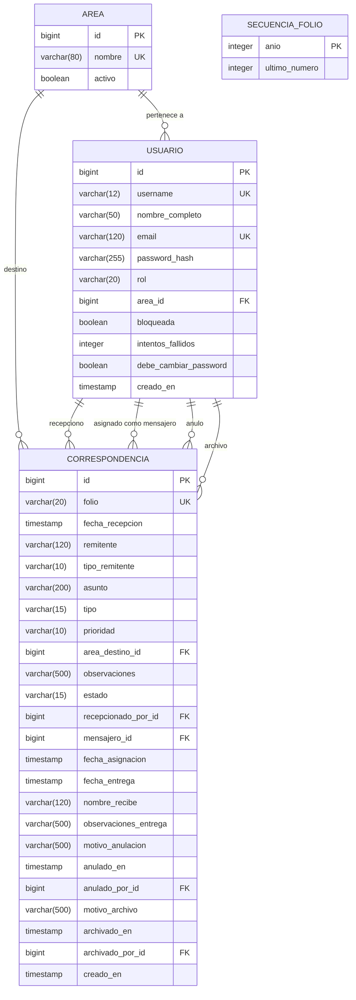

# Sistema de Gestion y Control de Correspondencia

Aplicacion web para registrar, distribuir, entregar, archivar y reportar la correspondencia interna y externa de una organizacion. Cubre el ciclo completo desde la recepcion hasta el archivo o anulacion, con distintos roles operativos y reportes en PDF.

---

## Stack

**Backend**
- Java 21 (compilado a bytecode 17)
- Spring Boot 4.1.0
- Spring Security 7 + OAuth2 Resource Server (JWT HS256)
- Spring Data JPA + Hibernate 7
- PostgreSQL 16
- Flyway (migraciones versionadas)
- OpenPDF 2.0.3 (reportes)
- Maven (con wrapper `mvnw`)

**Frontend**
- React 19 + Vite 8
- React Router 7
- Axios (con interceptores para JWT)

**Infraestructura**
- Docker + Docker Compose
- PostgreSQL en contenedor

---

## Requisitos previos

- **Java 21** (JDK)
- **Node.js 20+** y npm
- **Docker Desktop** (para la base de datos)
- Windows / macOS / Linux

---

## Correr en local — paso a paso

### 1. Clonar y entrar al proyecto

```bash
git clone <url-del-repo>
cd correspondencia
```

### 2. Levantar la base de datos

```bash
docker compose up -d
```

Levanta un PostgreSQL 16 en el puerto **5433** del host (el 5432 se reserva por si tienes un PostgreSQL nativo instalado).

Para detenerla mas tarde: `docker compose down`.

### 3. Backend

```bash
cd backend
./mvnw spring-boot:run
```

Al arrancar:
- Flyway aplica las migraciones necesarias (crea la tabla `flyway_schema_history` la primera vez).
- Hibernate valida que las entidades coincidan con el esquema.
- El `DataSeeder` (solo perfil `dev`) crea las areas iniciales y el usuario administrador.

El backend queda escuchando en `http://localhost:8080`.

### 4. Frontend

En otra terminal:

```bash
cd frontend
npm install
npm run dev
```

Abre `http://localhost:5173`.

### 5. Credenciales por defecto (perfil dev)

| Usuario | Contraseña | Rol |
|---|---|---|
| `admin` | `admin1234` | ADMIN |

Con ese usuario se puede crear el resto de cuentas (mensajeros, recepcionistas, supervisores).

---

## Alternativa: todo en Docker

Si prefieres levantar backend + base de datos juntos sin instalar Java localmente:

```bash
docker compose --profile full up -d --build
```

Sin `--profile full`, `docker compose up -d` solo levanta la base de datos (el comportamiento normal de dev).

---

## Estructura del proyecto

```
correspondencia/
├── backend/                    # Spring Boot
│   ├── src/main/java/com/magali/correspondencia/
│   │   ├── config/             # Seguridad, JWT, seed de datos
│   │   ├── controller/         # Endpoints REST
│   │   ├── dto/                # Requests y responses
│   │   ├── exception/          # Manejo global de errores
│   │   ├── model/              # Entidades JPA y enums
│   │   ├── repository/         # Spring Data JPA
│   │   └── service/            # Logica de negocio
│   ├── src/main/resources/
│   │   ├── application*.properties
│   │   └── db/migration/       # Scripts SQL versionados (Flyway)
│   └── Dockerfile
├── frontend/                   # React + Vite
│   └── src/
│       ├── components/         # UI reusable (Modal, Layout, RutaProtegida)
│       ├── context/            # AuthContext (JWT + usuario)
│       ├── pages/              # Una pagina por vista principal
│       └── services/           # Cliente HTTP (axios)
├── docker-compose.yml
└── README.md
```

---

## Roles y permisos

| Rol | Que puede hacer |
|---|---|
| **ADMIN** | Todo. Gestiona usuarios y areas, y puede ejecutar cualquier accion operativa. |
| **RECEPCIONISTA** | Registra correspondencia recibida (folio, remitente, area destino). Asigna mensajero. Anula correspondencia en estado RECIBIDA. |
| **MENSAJERO** | Ve solo la correspondencia asignada a el en estado EN_TRAMITE. Registra la entrega (nombre de quien recibio, observaciones). |
| **SUPERVISOR** | Consulta correspondencia, asigna mensajeros, archiva correspondencia entregada y genera reportes PDF. |


---

## Endpoints principales

Todos los endpoints (salvo `POST /auth/login`) requieren header `Authorization: Bearer <jwt>`.

| Metodo | Path | Roles permitidos | Descripcion |
|---|---|---|---|
| POST | `/auth/login` | publico | Login con username + password, devuelve JWT |
| POST | `/usuarios` | ADMIN | Crear usuario y devolver contraseña temporal |
| GET | `/usuarios` | ADMIN | Listar usuarios |
| POST | `/usuarios/{id}/desbloquear` | ADMIN | Desbloquear cuenta con intentos fallidos |
| GET | `/usuarios/mensajeros` | ADMIN, SUPERVISOR, RECEPCIONISTA | Listar mensajeros activos |
| GET | `/areas` | autenticado | Listar areas |
| POST | `/areas` | ADMIN | Crear area |
| POST | `/correspondencia` | ADMIN, RECEPCIONISTA | Registrar correspondencia (asigna folio) |
| GET | `/correspondencia` | autenticado | Consulta con filtros y paginacion |
| POST | `/correspondencia/{id}/asignar` | ADMIN, SUPERVISOR, RECEPCIONISTA | Asignar mensajero |
| POST | `/correspondencia/{id}/entregar` | ADMIN, MENSAJERO | Registrar entrega |
| POST | `/correspondencia/{id}/anular` | ADMIN, RECEPCIONISTA | Anular (solo desde RECIBIDA) |
| POST | `/correspondencia/{id}/archivar` | ADMIN, SUPERVISOR | Archivar (solo desde ENTREGADA) |
| GET | `/correspondencia/mis-asignaciones` | ADMIN, MENSAJERO | Correspondencia asignada al mensajero |
| GET | `/reportes/correspondencia.pdf` | ADMIN, SUPERVISOR | Descarga PDF con los filtros aplicados |

---

## Variables de entorno

Todas tienen valor por defecto en `dev`. En `prod` hay que definirlas explicitamente.

| Variable | Descripcion | Default en dev |
|---|---|---|
| `SPRING_PROFILES_ACTIVE` | Perfil activo (`dev` o `prod`) | `dev` |
| `SPRING_DATASOURCE_URL` | JDBC URL de PostgreSQL | `jdbc:postgresql://localhost:5433/correspondencia` |
| `SPRING_DATASOURCE_USERNAME` | Usuario de la BD | `correspondencia` |
| `SPRING_DATASOURCE_PASSWORD` | Password de la BD | `correspondencia` |
| `CORRESPONDENCIA_SEGURIDAD_JWT_SECRETO` | Secreto HS256 (min 32 caracteres) | `desarrollo-cambia-este-secreto-...` |
| `CORRESPONDENCIA_SEGURIDAD_CORS_ORIGINS` | Origenes permitidos (varios separados por coma) | `http://localhost:5173` |
| `PORT` | Puerto del backend (Railway lo asigna dinamico) | `8080` |

---

## Migraciones de base de datos (Flyway)

El esquema esta versionado en `backend/src/main/resources/db/migration/`. Cada cambio va en un archivo nuevo con nombre `V<n>__descripcion.sql`.

Al reiniciar la app, Flyway detecta el archivo nuevo y lo aplica automaticamente. Registra la ejecucion en la tabla `flyway_schema_history`.

---

## Diagrama entidad-relacion



**Ciclo de estados de una correspondencia:**

```
RECIBIDA --> EN_TRAMITE --> ENTREGADA --> ARCHIVADA
    |
    +--> ANULADA
```

---

## Notas de implementacion

- **JWT HS256**: el token se firma con `CORRESPONDENCIA_SEGURIDAD_JWT_SECRETO`. Expira en 120 minutos (`correspondencia.seguridad.jwt-expiracion-minutos`).
- **Bloqueo por intentos**: tras 5 intentos fallidos (`correspondencia.seguridad.max-intentos-login`), la cuenta se bloquea y solo un ADMIN puede desbloquearla.
- **Folio**: se genera en formato `CORR-<AAAA>-<NNNN>` con la tabla `secuencia_folio` y bloqueo pesimista para evitar duplicados en concurrencia.
- **Contraseña temporal**: al crear un usuario se muestra en un modal (solo esa vez). No se envia por correo en esta iteracion.
- **Perfil dev vs prod**: `dev` usa PostgreSQL local en Docker, seed automatico y logs detallados. `prod` usa variables de entorno para todo y logs conservadores.

---
